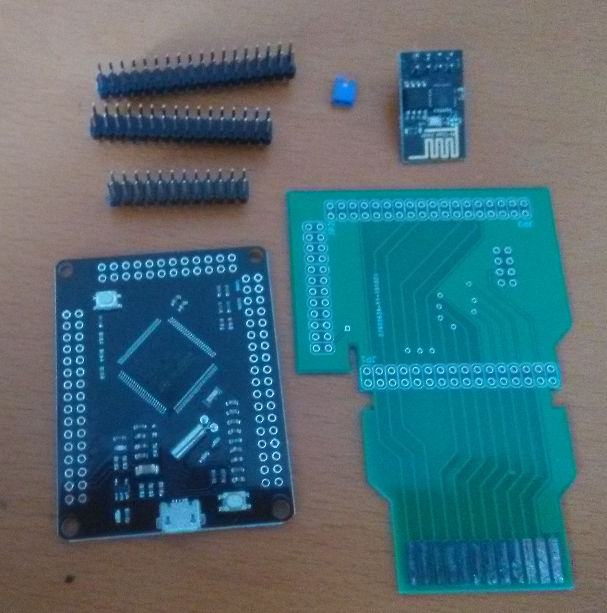

# Atari 2600 PlusCart

## Description
the Atari 2600 PlusCart ist based on Robin Edwards Unocart-2600 (https://github.com/robinhedwards/UnoCart-2600). The PlusCart has no SD-Card, but an ESP8266 to connect to a local WiFi Network and the Internet.
The PlusCart downloads the ROM-files from an Server in the Internet called the "PlusStore". The way this is done is similar to the way the Unocart-2600 loads ROMs from the FAT filesystem on the SD-card, while the VCS is performing a waitroutine in his RAM.

## PlusROM
Additionally the PlusCart has one more ROM emulator routine to emulate online ROMs called "PlusROM".
In the first bytes of such a PlusROM the path and the backend hostname or IP address has to be encoded (as strings both terminated by '\0'). Sending and receiving bytes to the host **does not need** a waitroutine in the VCS RAM! Hostname and path should be shorter than 256 bytes, so they do not affect the available ROM space, because they are encode in an address area that is overlayed by the RAM at runtime.

At the moment the PlusROM can be a 4K cartridge without RAM or a 32K cartridge with 128 bytes of RAM (@ 1000 to 10FF) and a 'Standard' F4 Bankswitching (@ 1FF4 to 1FFB). Both carts have 4 special adresses (before the bankswitching area):
- 1FF0 is for writing a byte to the send buffer (max 256 bytes)
- 1FF1 is for writing a byte to the send buffer and submit the buffer to the backend API
- 1FF2 contains the next byte of the response from the host, every read will increment the receive buffer pointer (receive buffer is max 255 bytes !) 
- 1FF3 contains the number of (unread) bytes left in the receive buffer (these bytes can be from multiple responses)

The bytes are send to the backend as content of an HTTP 1.0 POST request with "Content-Type: application/octet-stream". The User-Agent header of this request starts with "PlusCart/v" followed by the Firmware version (e.g. "0.1.0") and after a space a 24 Hex digit which is the STM unique device Id, for identifing the cart at the Backend.

The response of the backend should also be a "Content-Type: application/octet-stream" and the response-body should contain the payload and the first byte of the response should be the length of the payload, so "Content-Length" is payload + 1 byte. This is a workaround, because we don't have enough time in the emulator routine to analyse the "Content-Length" header of the response.

These definitions may change in the future (depending on the suggestions of experienced VCS Programmer).

The PlusROM emulation routine has been ported to [javatari.js](https://javatari.org/) and your homebrew PlusROMs can be tested [here](https://pluscart.firmaplus.de/javatari/index.html) 

## Flashing the firmware
For flashing of the firmware there is no ST-Link or other hardware necessary, only a micro USB cable and the  [STM32CubeProgrammer](https://www.st.com/en/development-tools/stm32cubeprog.html) is required. Downloading the STM32CubeProgrammer is free of charge (which is quit clear, because you have bought 1 of their chips), but you may have to register at the STM website. For connecting with the STM32CubePorgrammer the boot0 Jumper has to be removed, sometimes the reset button beside the USB connector has to pressed for 5 seconds, to establish the connection.

## Hardware (BOM):
- PlusCart breakout board -> upload Gerberfile at [JLPCB](https://jlcpcb.com/)
- [STM32F407VGT6 breakout board](https://www.diymore.cc/products/stm32f4-discovery-stm32f407vgt6-microcontroller-32bit-flash-mcu-arm-cortex-m4-core-development-board?_pos=7&_sid=3f87534b6&_ss=r)
- [ESP8266 esp-01s with stock firmware 1.6.2](https://www.google.com/search?q=esp8266+esp-01s&sa=X&hl=de&biw=1680&bih=920&tbm=shop&tbs=p_ord:r)

## Useful Software & Tools
- [STM32CubeProgrammer](https://www.st.com/en/development-tools/stm32cubeprog.html)
- [STM32CubeIDE](https://www.st.com/en/development-tools/stm32cubeide.html)
- [WUDSN IDE](https://www.wudsn.com/)
- [javatari](https://javatari.org/)
- [javatari **with PlusROM patch**](https://pluscart.firmaplus.de/javatari/index.html?ROM=../PlusClock.rom)
- [8bitworkshop](https://8bitworkshop.com/v3.4.2/?platform=vcs&file=examples%2Ftinyfonts2.a)
- [onlinegdb](https://www.onlinegdb.com/online_c_compiler)

## Assembly

## Specs
The GPIOs of the STM32 board are connected similar to the Unocart-2600 except for the SD card. And for Data IN and OUT the PlusCart uses the GPIOs **PC0-PC7**.
The ESP8266 is connected to USART1 (PA9 TX and PA10 RX ) of the STM32 Board.

Atari 2600 | STM32F407VGT6 | ESP8266 | Note
-----------|----------------|--------|------------
A0 to A12  | PD0 to PD12    |  nc    | Adressbus
D0 to D7   | **PC0 to PC7** |  nc    | Databus
5v         | VCC            | **nc** | 5 V
GND        | GND            | GND    | Ground
nc         | V33            | VCC    | 3.3 V
nc         | PA9            | RxD    | Tx -> RxD
nc         | PA10           | TxD    | Rx -> TxD
nc         | V33            | CH_PD  | CS

Copyright:

(c) Firmaplus(+) Ltd.

Dipl.Ing.(FH) Wolfgang Stubig
